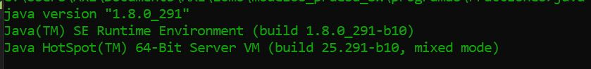
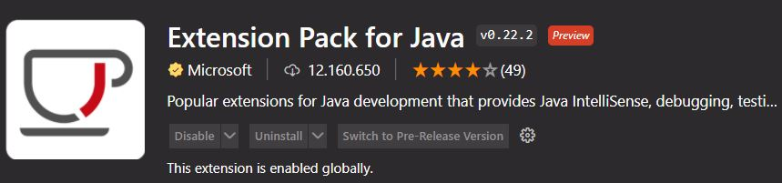

# Operaciones con Fracciones
## con Java

Este pequeño ejercicio comienza con una tarea de Modelos de prueba de software, la cual no pide una pequeña aplicación desarrollada en Java que haga operaciones con fracciones comenzando con la multiplicación. 

---

## CMD
Este ejercicio se distingue por no usar algun tipo de IDE sino más bien un bloc de notas y aprovechar la consola de Windows el CMD, consola o prompt para compilar y ejecutar.

### Establecer ruta para poder realizar compilaciones

Una vez que tienes instalado Java en tu equipo necesitas crear la variable de entorno que permita compilar los archivos con extensión ".java"

1) Crear la carpeta donde se almacenaran los archivos.
 
2) posicionarse dentro a traves de la consola usando comandos "cd" ó bien haciendo doble clic en el explorador de archivos justamente en la ruta del archivo y escribir CMD

3) una vez dentro puedes cerificar si cuentas con Java y Javac tipeando
~~~
"java -version"
~~~

4) ingresar el siguiente comando para establecer la ruta (no olvides usar tabulador):

~~~
SET PATH="C:\Program Files\Java\jdk - 11.0.6\bin";c:\WINDOWS;c:\WINDOWS\System32
~~~

Para guardar la ruta basta con ingresar:

~~~
path>rutajava.bat
~~~

con estos comandos emos establecido la ruta para que el sistema pueda compilar archivos java utilizando el comando: 

~~~
javac NOMBRE_ARCHIVO.java
~~~

y para ejecutar los programas hay que tipear:
~~~
java NOMBRE_ARCHIVO
~~~

Listo ! :trident:
con esto ya puedes crear tus archivos con blocs de notas y compilarlos y ejecutarlos desde tu consola.

#### Nota
si estas usando un editor de texto para compilar tus archivos como VSCODE se recomienda instalar la extensión: 
Extension Pack for Java

## proximamente

:soon:

- suma
- resta
- método simplificar por separado
- division
- Testing
- interfaz gráfica